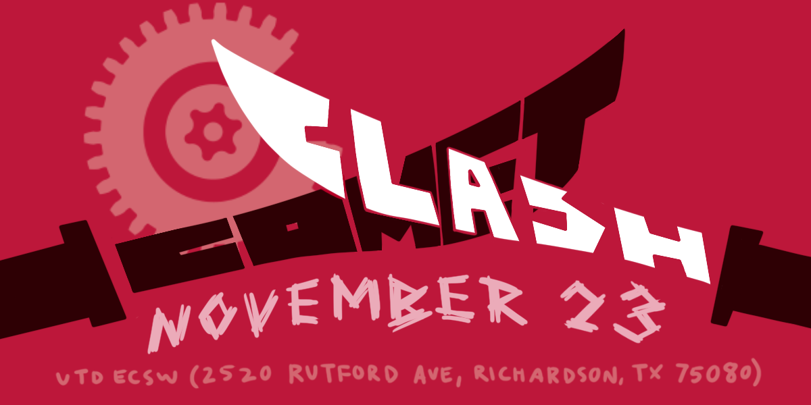

---
layout:
  title:
    visible: false
  description:
    visible: false
  tableOfContents:
    visible: false
  outline:
    visible: false
  pagination:
    visible: true
---

# 👋 Welcome!

<figure><figcaption></figcaption></figure>

## Welcome!

Comet Robotics at UT Dallas is proud to present Comet Clash 2024. Comet Clash is the first combat robotics event hosted at UT Dallas, but follows a long history of combat robotics at the university!

## Quick Links

<table data-view="cards"><thead><tr><th></th><th></th><th></th><th data-hidden data-card-cover data-type="files"></th><th data-hidden data-card-target data-type="content-ref"></th></tr></thead><tbody><tr><td><strong>Robot Combat Events page</strong></td><td>Register for Comet Clash 2024 and find up to date information about the event here.</td><td></td><td><a href=".gitbook/assets/IMG_0123.jpeg">IMG_0123.jpeg</a></td><td><a href="https://www.robotcombatevents.com/events/2501">https://www.robotcombatevents.com/events/2501</a></td></tr><tr><td><strong>Discord Server</strong></td><td>Join the 'Comet Robotics at UT Dallas Events' for updates on Comet Clash 2024, and future events.</td><td></td><td><a href=".gitbook/assets/CleanShot 2024-11-21 at 18.02.44@2x.png">CleanShot 2024-11-21 at 18.02.44@2x.png</a></td><td><a href="https://discord.gg/QjEgWSvuQV">https://discord.gg/QjEgWSvuQV</a></td></tr><tr><td><strong>Robot Registration Fee</strong></td><td>Pay robot registration fees at this link. </td><td>$10/robot for students, $20/robot for non-students.</td><td><a href=".gitbook/assets/CleanShot 2024-11-21 at 17.53.54@2x.png">CleanShot 2024-11-21 at 17.53.54@2x.png</a></td><td><a href="https://comet-robotics.square.site/product/comet-clash-2024-robot-registration-fee/8">https://comet-robotics.square.site/product/comet-clash-2024-robot-registration-fee/8</a></td></tr><tr><td><strong>Live Stream</strong></td><td>Matches will be streamed to our YouTube channel at this page.</td><td></td><td><a href=".gitbook/assets/IMG_9230.JPG">IMG_9230.JPG</a></td><td><a href="https://youtube.com/live/NTgX-pgiQPU">https://youtube.com/live/NTgX-pgiQPU</a></td></tr><tr><td><strong>Volunteer Application</strong></td><td>Interested in volunteering? Complete this form and we'll get back to you shortly!</td><td></td><td><a href=".gitbook/assets/Screenshot 2024-11-02 161034.png">Screenshot 2024-11-02 161034.png</a></td><td><a href="https://forms.gle/gjj8Sbr8J9DgzW7J8">https://forms.gle/gjj8Sbr8J9DgzW7J8</a></td></tr><tr><td><strong>Shirt Order Form</strong></td><td>Get your Comet Clash T-Shirts now! Orders due by 10pm on <strong>November 5th.</strong> So swag. </td><td>Missed preorders? A limited number of shirts will be available for purchase at the event.</td><td><a href=".gitbook/assets/Comet Clash 2024 T-Shirt Mockup - Front.png">Comet Clash 2024 T-Shirt Mockup - Front.png</a></td><td><a href="https://comet-robotics.square.site/product/comet-clash-2024-t-shirt/7">https://comet-robotics.square.site/product/comet-clash-2024-t-shirt/7</a></td></tr></tbody></table>

## Logistics

Spectators are welcome

### Event Location and Parking

Comet Clash 2024 is hosted at the UT Dallas Engineering and Computer Science West (ECSW) building.&#x20;


2513 Rutford Ave, Richardson, TX 75080, USA

[Google Maps link](https://g.co/kgs/Hs4rZbD) | [Apple Maps link](https://maps.apple.com/?address=2513%20Rutford%20Ave,%20Richardson,%20TX%20%2075080,%20United%20States\&ll=32.985910,-96.751197\&q=2513%20Rutford%20Ave)


Parking is free! You will want to park in Lot I or Parking Structure 4 (both highlighted in <mark style="color:orange;background-color:orange;">orange</mark>), which are both directly adjacent to the ECSW building where the event is hosted (highlighted in <mark style="background-color:green;">green</mark>).&#x20;

<figure><figcaption></figcaption></figure>


While parking is free, you **must** display a valid parking permit in a visible location on your vehicle to avoid being fined ticketed. We will have printed copies available in the ECSW building for you to place in your vehicle, or print the PDF file below ahead of time.

This parking permit only allows free parking in spots marked as **orange, gold, or green**. You may be subject to fines if you park in a spot marked as another color (ex: red or purple),&#x20;




### Concessions

### Competition Format&#x20;

### Judging Format&#x20;

### Concessions Info

### Pit Setup

Tables and chairs will be provided. Note that pit is on the floor above the competition area. Will need to use stairs or elevators to get to the pits.

Battery charging is permitted in any location as long as they are in battery bags

Soldering is not permitted in the pits area. Signage will direct competitors to the Electronics Workshop (ECSW 1.TBD), where soldering is permitted.

### Battle Box

The main competition box has an 8 foot x 8 foot floor area. The kickplates are 2x4, and are recessed into the floor so forks can't get stuck under them. There will be a 4 foot x 4 foot box available for testing.

### Quick Rules Recap

* 5 second pins, no weight bonuses, 1 unstick per bot if stuck on the arena. Exposed battery is a KO, 5-6-6 judging format.
* Specifically for the plastic antweight competition, your bots MUST be 3d printed. To keep with the spirit of beginners and experimental designs, the winning robot design will be banned forever and added to a hall of fame to be displayed at future events.&#x20;
* 1 unstick on the arena per bot per fight if it is stuck in the arena. Examples include: Stuck in the wall, stuck in the floor, etc. Unsticks will not be given for bots who are upside down or tipped up against the arena wall.

### Challonge Links

<table data-view="cards"><thead><tr><th></th><th></th><th></th><th data-hidden data-card-cover data-type="files"></th></tr></thead><tbody><tr><td><strong>Plantweight Bracket</strong></td><td></td><td></td><td><a href=".gitbook/assets/453400804_907583448077786_6773884224343523008_n.jpg">453400804_907583448077786_6773884224343523008_n.jpg</a></td></tr><tr><td><strong>Antweight Bracket</strong></td><td></td><td></td><td><a href=".gitbook/assets/453400804_907583448077786_6773884224343523008_n.jpg">453400804_907583448077786_6773884224343523008_n.jpg</a></td></tr><tr><td><strong>Beetleweight Bracket</strong></td><td></td><td></td><td><a href=".gitbook/assets/453400804_907583448077786_6773884224343523008_n.jpg">453400804_907583448077786_6773884224343523008_n.jpg</a></td></tr></tbody></table>


Comet Robotics at UT Dallas, a registered student organization at The University of Texas at Dallas, will not take custodial responsibility of minors while participating in Comet Clash 2024. Custodial responsibility will remain with teachers K-12, parents, legal guardians, and chaperones.

