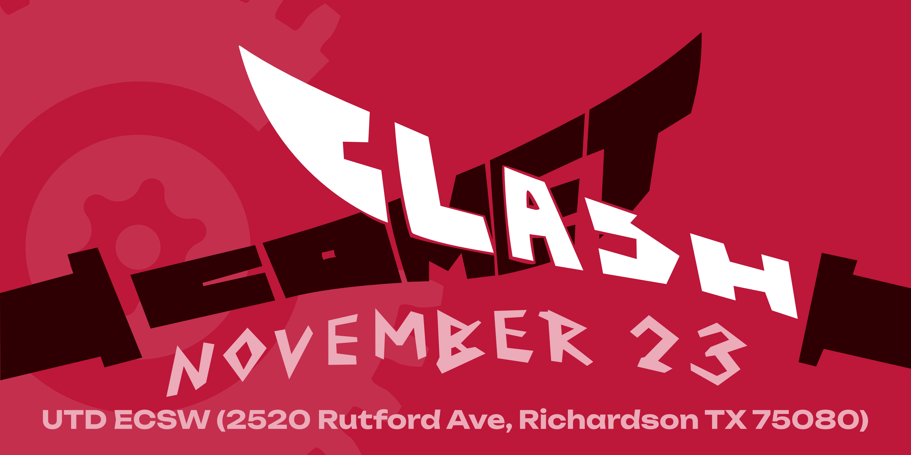

---
layout:
  title:
    visible: false
  description:
    visible: false
  tableOfContents:
    visible: false
  outline:
    visible: false
  pagination:
    visible: true
---

# 👋 Welcome!

<figure><figcaption></figcaption></figure>

## Welcome!

Comet Robotics at UT Dallas is proud to present Comet Clash 2024! Comet Clash is the first combat robotics event hosted at UT Dallas, but follows a long history of combat robotics at the university!

**Location:** Indoors at the [ECSW building](https://maps.app.goo.gl/p5v51uZAD87QZ1QH9) (2520 Rutford Ave, Richardson, TX 75080)&#x20;

**Time:** Competitors can begin arriving and do safety at 7:30. Matches planned to start at 9:00 AM. Please be on-site by 8:30 AM so we can get all robots through safety on time. We plan to finish at 6:00pm, but the building won't close until 9:00pm, so we will go until we finish.&#x20;

**Facilities:** We plan to provide plenty of Tables and chairs, but this is pending. Bathrooms, elevators are onsite. Electrical outlets may be limited, so it is recommended to bring your own power strips and extension cords.&#x20;

**Arena:**  The arena is 8 ft x 8 ft x 4 ft tall with a wooden floor.  There is a seam in the middle of the floor, but we do our best to minimize it.

**Robots:**  Robots must meet the SPARC V1.4 Robot Construction Specifications. In addition, no fire weapons or ICE (Internal Combustion Engines). A lipo charging bag must be used when charging batteries. Weapon locks and sharp edge covers must be used while the bot is outside of the arena.&#x20;

**Weight Classes:** 16 Plastic Ant (1lb plastic), 16 Ant (1lb) and 16 Beetle (3lb).

**Format:** Dependent on number of entrants.  Robots registered in tournament will be guaranteed at least two fights.&#x20;

**Fees:** The registration for the tournament is $20 per bot and will be handled at the event. ($10 for Plants and College teams)

**Prizes:** Trophies for 1st, 2nd, and 3rd place finishers in each weight class.

**Parking:** Parking TBD

Join our Discord for more updates! [https://discord.gg/QjEgWSvuQV](https://discord.gg/QjEgWSvuQV)

## Quick Links

<figure><figcaption></figcaption></figure>

<table data-view="cards"><thead><tr><th></th><th></th><th></th><th data-hidden data-card-cover data-type="files"></th></tr></thead><tbody><tr><td></td><td>Testing testing</td><td></td><td><a href=".gitbook/assets/comet_clash_banner.png">comet_clash_banner.png</a></td></tr><tr><td></td><td></td><td></td><td></td></tr><tr><td></td><td></td><td></td><td></td></tr></tbody></table>

Register on Robot Combat Events

Fill out minor waiver

Pay participation fee

## Contact

Email: cometrobotics@utdallas.edu

Socials here
