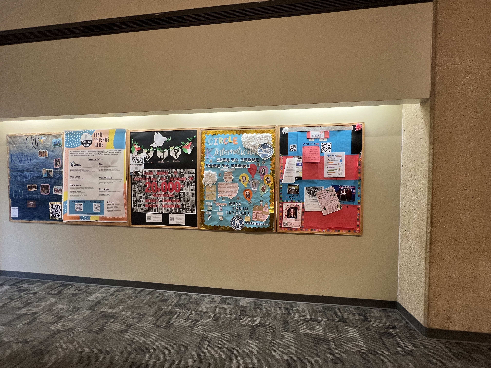

# Marketing with the SOC

## Disclaimer!

Any material made in partnership with the SOC must have the following disclaimer:

> \[Name of publication] is published by \[name of student organization], a registered student organization. \[Name of publication] is not an official publication of UT Dallas and does not represent the views of the university or its officers. The University of Texas at Dallas is an Equal Opportunity/Affirmative Action University. Students with disabilities needing special assistance to atend please call (972-883-2946) \[or the number of Fraternity and Sorority Life (972-883-6523)]. Texas Relay Operation: 1-800-RELAYTX.

## Fliers

The SOC provides free fliers for any student organization events! These should be taken advantage of for every event

* 25 Full-Color Tabloid Prints
* 50 Full-Color Letter Prints
* These fliers MUST include the SOC disclaimer.
* These 75 prints are available for every event

## Posters

The SOC provides 5 free posters per academic year. These should be taken advantage of as they are typically printed in great quality, huge sizes, all free!


## Bulletin Board

The SOC provides us with one Bulletin Board in the Student Union. Our current board is

```
Board # : 54
```

<figure><figcaption><p>SOC Bulletin Board</p></figcaption></figure>

There are specific rules that must be followed for the bulletin board. As of Fall 2024, they are as follows:

* The organization's name must be fully spelled out. Acronyms do not count.
* The executive board must be listed.
*   The board also needs to have up-to-date organization contact information (i.e. contact email

    address, social media accounts, website, etc.)
* General organization meetings, times, and dates should also be listed.
* Boards should also list the organization's purpose or mission statement.
*   Individual event posters or flyers must be removed the first business day after the event has

    been completed.
* The entire board must be covered and decorated.


Fall 2024 Bulletin Board Guidelines


## SOC Events

The SOC offers many resources for events, please reference the page below:


[Broken link](broken-reference)


## Digital Signage

Digital signage allows student organizations to use digital displays on campus to advertise their student organization.&#x20;

* Advertisements will run for 14 days
* You can continuously request that advertisements be put out but this is discouraged by the SOC
* Instead, try to use digital signage for specific events, giving at least a week gap between advertisements

More information can be found here:



