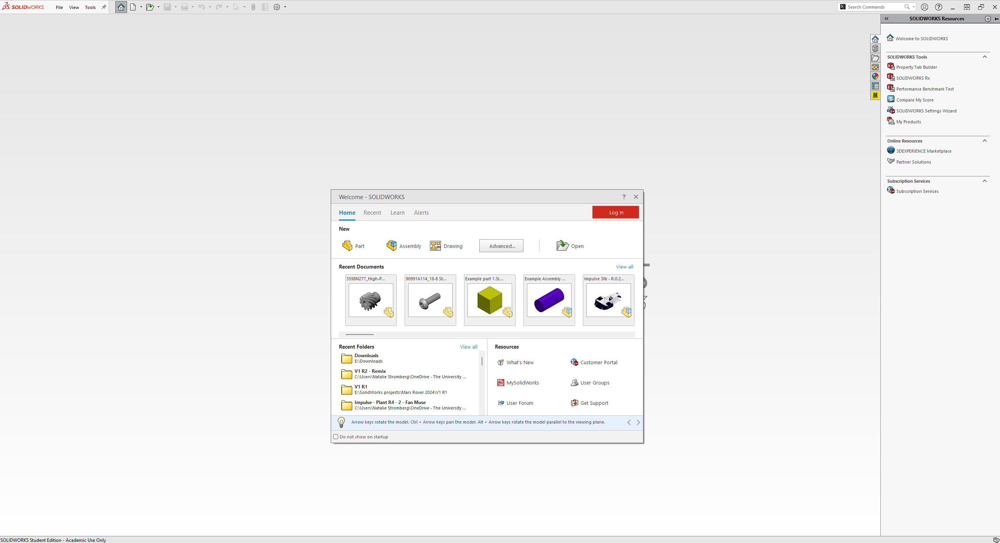

# Introduction to Solidworks

Welcome to Solidworks! Solidworks is a powerful CAD program that we will use to make our first combat robot. This and the following pages assume you have a machine with Solidworks on it, ready to open. If you haven't installed Solidworks yet, go to the [Installing Solidworks](installing-solidworks.md) page.&#x20;

### Concepts:

* Parts - The basic building blocks of your robot
* Assemblies - Contain parts or even other 'subassemblies'
* Sketches - 2D drawings that define aspects of a 3D model
* Features - Using one or more sketches to create 3D geometry

## Opening Solidworks

When you first open Solidworks, you'll see a page similar to this one:\

<figure><figcaption>
Solidworks 2023 Homepage
</figcaption></figure>

If your home screen doesn't look exactly the same as mine, that's ok. Let's jump into making our first part.

## Solidworks Tutorials

Solidworks has built in tutorials that make learning the basics very easy. **TRUST ME THESE ARE WORTH YOUR TIME.** You can find them by clicking the "Learn" tab:

<figure><figcaption></figcaption></figure>

Then click "Step-by-Step Tutorials":

<figure><figcaption></figcaption></figure>

Solidworks will automatically change your view to look like this:

<figure><figcaption>
Solidworks in split screen view with tutorials
</figcaption></figure>

Ignore the first two that are listed there. We're interested in "Lesson 1: Parts" and "Lesson 2: Assemblies". Click them and they'll guide you through the creation of your first two parts and putting them in an assembly. If you want a video to help you with the first tutorial, you can check out this one by GoEngineer: [https://www.youtube.com/watch?v=HKSo99hGDd4](https://www.youtube.com/watch?v=HKSo99hGDd4) even though it's a little dry, it'll help you follow the tutorial step by step and give some tips along the way.&#x20;

**With the knowledge you gain in these 2 tutorials, we can start designing our first robot!**

(If you want to continue the built in Solidworks tutorial, which is completely optional, I recommend you go to the 'Basic Techniques' tab and go through from 'Fillets' to 'Surfaces' tutorials in order.)
