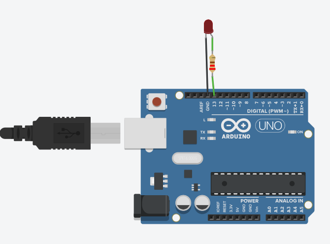

# Part 1: Running Blinky

## Prerequisites&#x20;

Before we jump into this exercise, we should install a few things. If you haven't already, follow the steps under [Getting Started](../getting-started.md) to set up PlatformIO and VSCode. While not strictly necessary to perform any of these exercises, it will be needed to upload code to hardware if you are not using a simulator. Since this tutorial will be using Autodesk TinkerCAD, we can access it completely from a web browser. Make sure you have done the following to set up TinkerCAD.

1. Go to the[ TinkerCAD website](https://www.tinkercad.com/).
2. Create an account and login  using either your student or personal email.
3. Navigate to the tab that says **Designs** and click on **+Create**. A drop down menu should appear with different options. Press on the **Circuits** option to create a new schematic window.&#x20;
4. You should now have a new circuit design with a code window and component inventory.&#x20;

## Arduino Uno&#x20;

For these exercises, we will be relying on the Arduino Uno R3 board simulated in TinkerCAD. Figure 1 depicts the Uno's pinout diagram. The[ full diagram](https://store.arduino.cc/products/arduino-uno-rev3?queryID=undefined) is also accessible on the manufacturer's page.

The digital pins will be our main focus for the next few exercises. Arduino maps pin names to a corresponding integer value. For instance, digital pin "D1" is defined as "1" in an Arduino program.&#x20;

Digital pins such as D0-D19 behave in a binary manner, sending or receiving logical HIGH or logical LOW signals. HIGH corresponds to 5V (as Arduino uses 5V) while LOW corresponds to 0V.  Analog pins such as the A0-A5 row are capable of sending or receiving analog values as well. Other pins may be suited to communication protocols such as I2C (D19 and D18) or SPI (D10-D13).&#x20;

One might notice how pins can serve several functions; for example D14/A0 can be used as either a digital or analog pin. This is example of **pin multiplexing**. The Arduino also has some other special pin mappings such as **LED\_BUILTIN** which controls the board's built-in LED. This is typically tied to D13.&#x20;


Note: a pin can only be used for one function at a time


<figure><figcaption><p>Figure 1: Arduino Uno Pinout </p></figcaption></figure>

## Breadboards&#x20;

The solderless breadboard in Figure 2 is commonly used for prototyping circuits. It consists of two sections for plugging in a power source, denoted by the + anode and - cathode symbol. Between the power rails, there are two 5-row terminal strips separated by a center divider.  Jumper cables, shown in Figure 3, can be used to connect different components on the board together.&#x20;


Each hole on one row of the power strip is connected together. Likewise, rows of 5 on the board are also connected together.&#x20;


<figure><figcaption><p>Figure 2: Layout of Solderless breadboard. </p></figcaption></figure>

<figure><figcaption><p>Figure 3: Male-to-Male Jumper Cables </p></figcaption></figure>

## Uploading Blinky&#x20;

We'll now be uploading the "hello world" of embedded systems, a program that blinks an LED. In TinkerCAD, do the following.&#x20;

1. In the **Components** drop down menu, select the **Arduino** tab under the **Starter** section. You should now have a list of example circuits to choose from.
2. Select the second circuit named **Blink** and place it down into your schematic.&#x20;
3. Run the program by clicking **Start Simulation.** You should see an LED that flashes every second.&#x20;

<figure><figcaption><p>Figure 4: Blink circuit in TinkerCAD </p></figcaption></figure>

## Arduino Programming Syntax&#x20;

The "Arduino programming language" is a variety of C++ that has a lot of abstraction for accessing different peripherals and devices on an embedded system. Because of its simplicity and support for many boards, the Arduino language is a very versatile tool for a lot of projects. In this section, we should acquaint ourselves with several basic functions that allow writing to and reading from general purpose input/output (**GPIO**) pins as well as scheduling delays in our system. &#x20;

```
pinMode(pin, mode)
```

This function allows us to configure one of the pins on the board to either an INPUT or OUTPUT. Under the hood, the microcontroller sets the data direction register value to 1 for output and 0 for input (in the case of the AtMega328P), but Arduino abstracts this way, so all we have to do is give the pin name and either INPUT or OUTPUT for the mode. For instance, to make D13 an output pin, we write `pinMode(13, OUTPUT);`

```
digitalRead(pin)
```

This function does what it describes; it reads the current value at that pin. This is an example of **polling** where the CPU checks if the device connected to the pin needs attention at a regular interval. This is not to be confused with **interrupts** which will be described in a later section. Let's say we want to read from an INPUT pin D10. To poll D10 we would write `digitalRead(10);`&#x20;

```
digitalWrite(pin, value) 
```

Instead of reading a pin, this function allows us to write a logical HIGH or LOW value to an OUTPUT pin. Let's say we want to turn on the Arduino's built-in LED. You can either write `digitalWrite(13, HIGH;` or `digitalWrite(LED_BUILTIN, HIGH);` To turn off the LED, pass LOW instead.&#x20;

```
delay(ms) 
```

This function pauses the program for the amount of time (in milliseconds) passed as a parameter. This is the simplest way to create a delay in your program. However, in later sections we will learn why using the standard `delay()` function may not be ideal for your program and we will introduce alternative methods of performing a delay.&#x20;

## void setup() and void loop()&#x20;

You will notice every Arduino program requires a `void setup()` and a `void loop()` to compile. `void setup()` is a function that will only run once in your program. It is typically used one time actions such as configuring IO pins and communication protocols. `void loop()` on the other hand is where the bulk of your program will be stored. This function will run indefinitely until the board is reset or powered off.&#x20;

## Challenge #1: Flash an LED with button&#x20;

* Objective: using `digitalRead` to poll the button, try control the rate an LED blinks. For example, you could have a slower and a faster mode.&#x20;
* Read the section on **Debouncing** to figure out how to poll the button properly.&#x20;

## Challenge #2: Ready, Set, Go! Countdown&#x20;

* Objective: Make a program that flashes a sequence of LEDs beginning with red for "Ready", then yellow for "Set" and finally green for "Go!" whenever a button is pressed. You can choose how much delay you want in between each LED.&#x20;
* All LEDs should be off after the cycle is complete.&#x20;

## Challenge #3: 4-bit Binary Counter&#x20;

* Objective: Design a program that counts up through a 4-bit binary number (0-15) and returns to 0 after reaching 15. You can use 4 LED to represent the binary number.&#x20;
* Optional: Design the program so binary value increases by 1 each time a button is pressed.

## Debouncing &#x20;

Due to electrical/mechanical faults, the button may switch between a HIGH and LOW state very rapidly before reaching a steady value. For now, you can add a `delay()` after reading the button to make sure it has a steady state. A 50ms delay should be more than enough to address the debouncing.&#x20;

